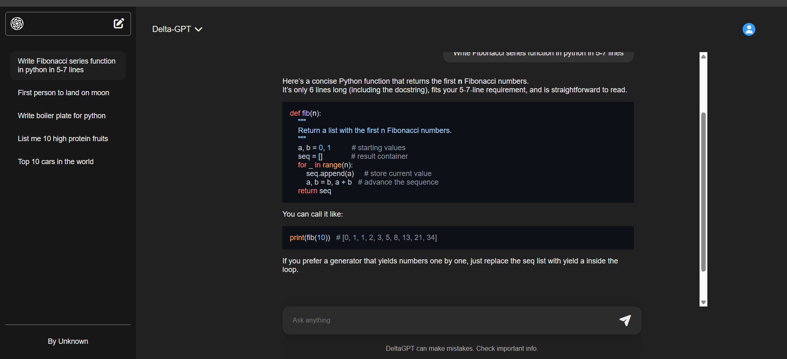

# AI-Powered Conversational Assistant

A full-stack conversational AI chatbot built on the MERN stack, featuring persistent chat history, multi-threaded conversations, and JWT-based user authentication.

##  Features

- Conversational AI powered by LLM API integration
- Multi-threaded chat sessions — create, view, and delete individual conversation threads
- Persistent chat history stored in MongoDB
- User authentication (JWT-based login/register) so each user's conversations stay private




##  Tech Stack

**Frontend**
- React (Vite)
- Context API for state management
- Axios / Fetch for API calls

**Backend**
- Node.js + Express.js
- MongoDB with Mongoose
- JWT (jsonwebtoken) + bcrypt for authentication
- LLM API integration for AI responses

## Getting Started

### Prerequisites
- Node.js (v18+)
- MongoDB Atlas account (or local MongoDB instance)
- An LLM API key (e.g. OpenAI)

### 1. Clone the repository
```bash
git clone https://github.com/DipanshuK04/AI-Powered-Conversational-Assistant.git
cd AI-Powered-Conversational-Assistant
```

### 2. Backend Setup
```bash
cd Backend
npm install
```

Create a `.env` file in `Backend/`:
```env
MONGODB_URI=your_mongodb_connection_string
PORT=8080
OPENAI_API_KEY=your_openai_api_key
JWT_SECRET=your_jwt_secret
```

Run the backend:
```bash
npm start
```

### 3. Frontend Setup
```bash
cd Frontend
npm install
npm run dev
```

The app will be available at `http://localhost:5173` (default Vite port).

## API Endpoints

| Method | Endpoint                | Description                  |
| ------ | ----------------------- | ---------------------------- |
| POST   | `/api/auth/register`    | Register a new user          |
| POST   | `/api/auth/login`       | Login and receive JWT token  |
| GET    | `/api/thread`           | Get all chat threads         |
| GET    | `/api/thread/:threadId` | Get messages for a thread    |
| DELETE | `/api/thread/:threadId` | Delete a thread              |
| POST   | `/api/chat`             | Send a message, get AI reply |


